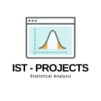

#  Using Z Value To Check-Effectiveness-Of-Blood-Pressure Drug
> **Brief Description:** A pharmaceutical company developed a new drug intended to lower blood pressure. To determine the drug's effectiveness, a clinical trial was conducted. Researchers wanted to see if there was a statistically significant difference in blood pressure levels before and after administering the drug.
> 

---

## Table of Contents

- [Description](#description)
- [Video Explanation](#video)
- [Technologies Used](#technologies-used)
- [Dataset](#dataset)
- [Program Codes ](#program-codes)
- [Screenshots](#screenshots-and-explanations)
- [Contribution](#contributipn)
- [Contact Details](#contact-details)

---

## Description

A pharmaceutical company developed a new drug intended to lower blood pressure. To determine the drug's effectiveness, a clinical trial was conducted. Researchers wanted to see if there was a statistically significant difference in blood pressure levels before and after administering the drug.

**Study Design**
- Sample Size: 100 patients
- Pre-treatment Mean Blood Pressure (µ₀): 140 mmHg
- Post-treatment Mean Blood Pressure (X̄): 135 mmHg
- Standard Deviation (σ): 15 mmHg
- Significance Level (α): 0.05

**Hypotheses**
- Null Hypothesis (H₀): The mean blood pressure after treatment is equal to or greater than the mean blood pressure before treatment (µ₁ ≥ µ₀).
- Alternative Hypothesis (H₁): The mean blood pressure after treatment is less than the mean blood pressure before treatment (µ₁ < µ₀).

## Video
<!--
 
-->

We are working on this section. Please check at some other time.

## Technologies-used

Python programming language, pandas and matplotlib package.

## Dataset

The data set is synthetically generated and used for demonstrating the concept only. The program can be easily modified to show results with real readings taken from the patients.

## Program-codes

The programs are written on jupiter notebook, You may run the program on Google colab by clicking on the colab badge below.

## Screenshots and explanations

##Interpretation
- The z-value of -3.11 indicates how many standard deviations the observed mean (136.23 mmHg) is below the hypothesized mean (140.90 mmHg).
- Using the standard normal distribution table, a z-value of -3.11 corresponds to a very low p-value 0.00093 (much less than 0.05).

Since the p-value is lower than the significance level (α = 0.05), the researchers reject the null hypothesis.

## Contribution

The programs are written by Santanu Karmakar

## Contact-details

If you wish to contact me, please leave a message (Preferably WhatsApp) on this number: 6291 894 897.
Please also mention why you are contacting me. Include your name and necessary details.
Thank you for taking an interest.
